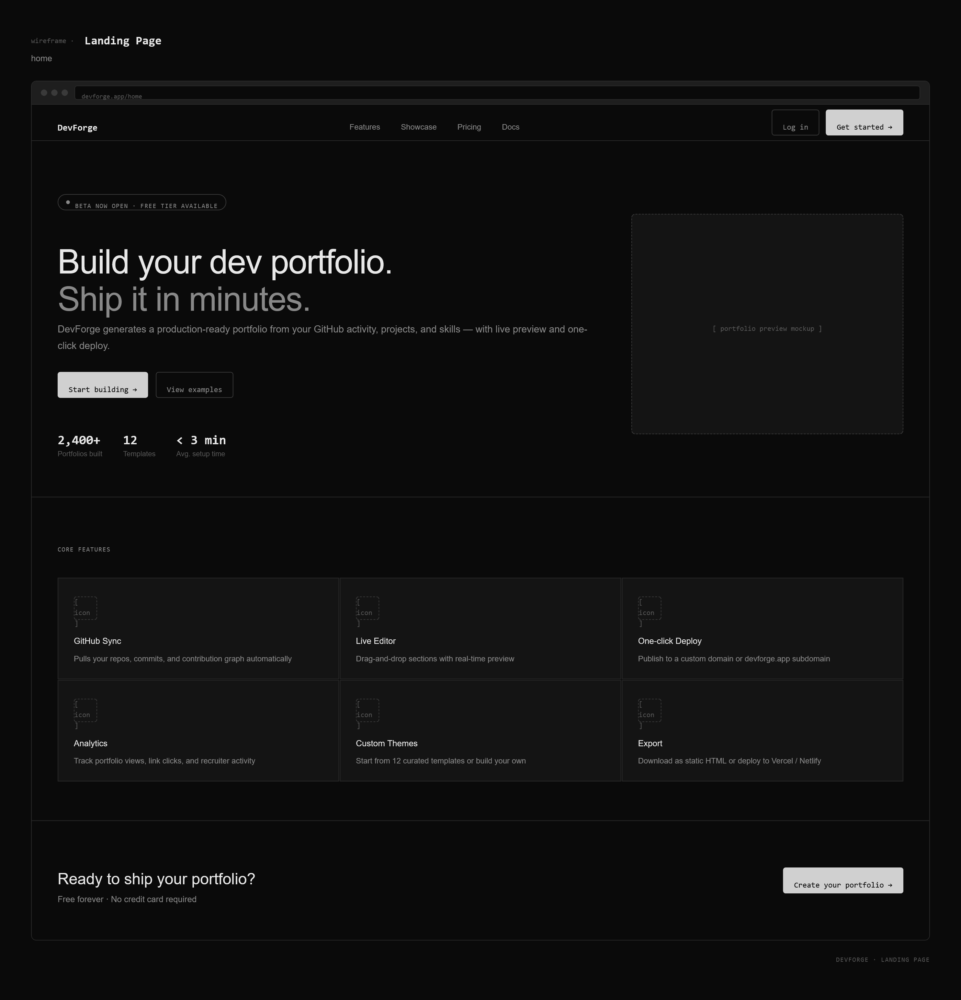
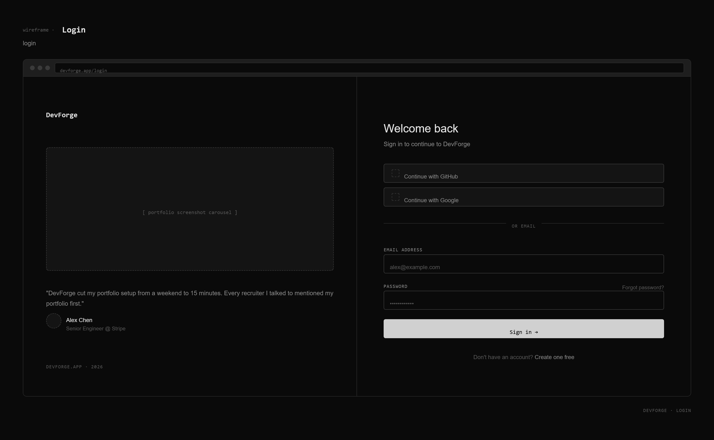
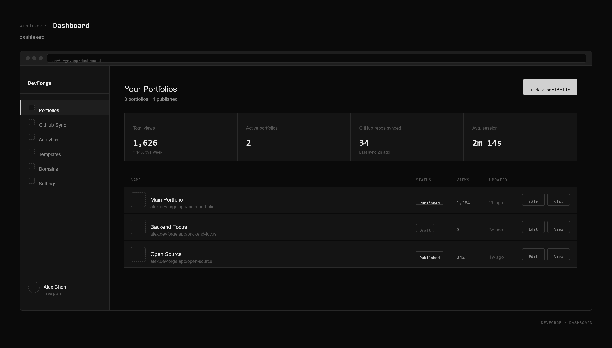
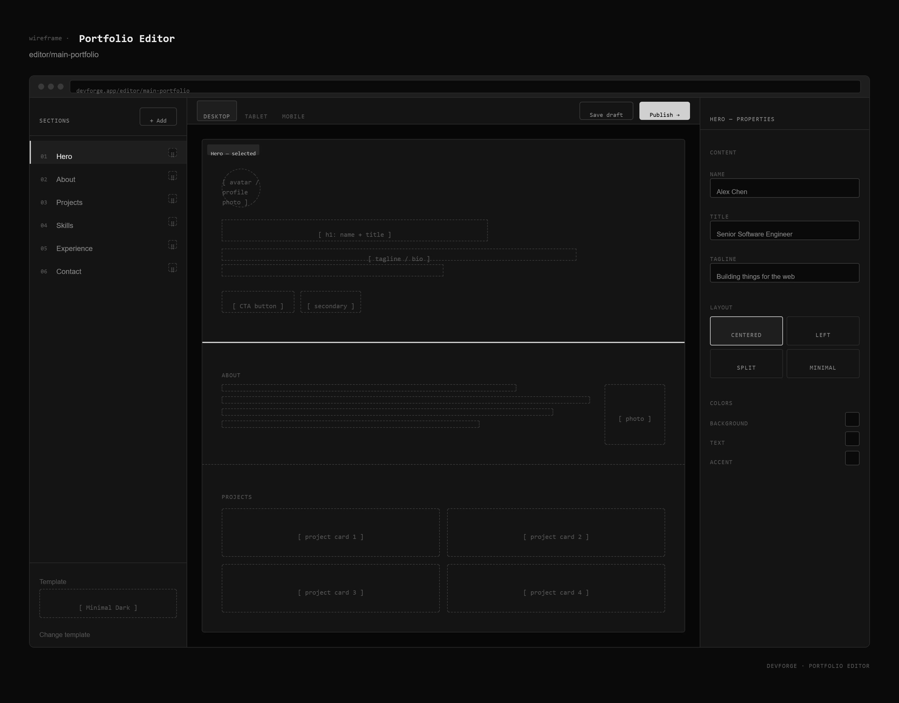
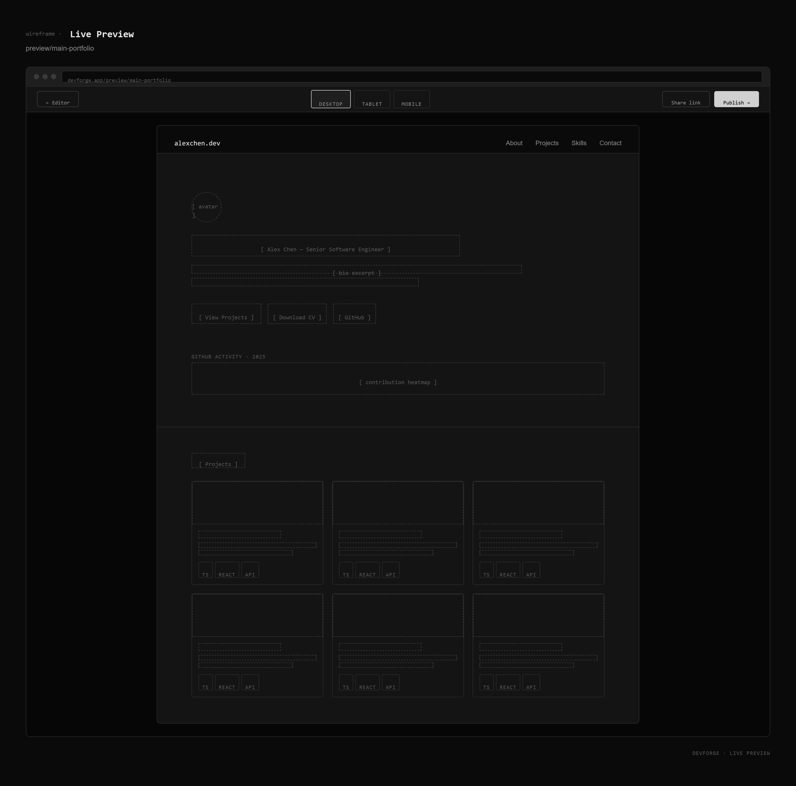

<div align="center">
</img>
</div>

<div align="center">
  
  
  
  
  
  
  
  
  
</div>

---

DevForge is a portfolio builder designed specifically for developers. It allows users to create professional portfolio websites without writing frontend code by providing an intuitive editing experience, customizable templates, and real-time previews.

---

# Features

## Current

- Responsive landing page
- Modular React component architecture
- Project documentation
- Modern project structure

## Planned

- Firebase Authentication
- Portfolio management dashboard
- Live portfolio preview
- Multiple portfolio templates
- Theme customization
- Cloud Firestore integration
- Responsive editor
- Portfolio publishing
- Deployment with Vercel

---

## Project Structure

```text
src/
│
├── animations/
├── assets/
├── components/
│   ├── common/
│   ├── forms/
│   ├── landing/
│   ├── layout/
│   ├── preview/
│   └── templates/
│
├── constants/
├── context/
├── hooks/
├── pages/
├── services/
├── styles/
├── types/
├── utils/
│
├── app.tsx
└── main.tsx
```

---

# Design Philosophy
DevForge follows a minimalist design philosophy inspired by modern SaaS applications. The interface avoids excessive decoration and instead emphasizes whitespace, typography, and hierarchy to guide users through the portfolio creation process.

Core design principles include:
```
- Simplicity over complexity
- Functionality over decoration
- Consistency over novelty
- Accessibility by default
- Responsive-first development
```

---

# Target Audience
The interface is designed primarily for:
```
- Computer Science students
- Software engineers
- Frontend developers
- Backend developers
- Full-stack developers
- Freelancers
- Open-source contributors
```
These users generally value clean interfaces and efficient workflows over unnecessary visual effects.

---

# Wireframes
Initial application layouts were designed using Figma before development began.
The wireframes establish the structure and navigation flow of the application and include:

- Landing Page
- Login Page
- Dashboard
- Portfolio Editor
- Live Preview

The following low-fidelity wireframes define the initial user interface and user flow for DevForge. These designs serve as a blueprint for implementation and may evolve throughout development.

## Landing Page



## Login



## Dashboard



## Portfolio Editor



## Live Preview



---

# Roadmap

## Module 1
**Timeline:** July 20 – July 26, 2026

### Objectives
Establish the project's foundation by planning the application, designing the user interface, and setting up the frontend development environment.

### Deliverables
```
- Gather and document project requirements.
- Create application wireframes using Figma.
- Set up the React project using Vite.
- Configure TypeScript and Tailwind CSS.
- Organize the project structure.
- Initialize the GitHub repository.
- Develop a responsive landing page.
- Prepare initial project documentation.
```

### Module Outcome
At the end of Module 1, the project should have a well-defined structure, complete planning documentation, and a polished landing page ready for future feature implementation.

## Module 2
**Timeline:** July 27 – August 2, 2026

### Objectives
Implement the application's core functionality by enabling authentication and portfolio management.

### Deliverables
```
- Implement Firebase Authentication.
- Configure Cloud Firestore.
- Design the portfolio management dashboard.
- Implement CRUD functionality for portfolios.
- Create the portfolio editor interface.
- Build the live preview component.
- Connect the frontend with Firebase.
- Update project documentation.
```

### Module Outcome
At the end of Module 2, users should be able to securely sign in, create portfolios, edit portfolio information, and preview changes in real time.

## Module 3
**Timeline:** August 3 – August 9, 2026

### Objectives
Improve the overall user experience by introducing customization features, responsive layouts, and polished interface interactions.

### Deliverables
```
- Develop multiple portfolio templates.
- Implement responsive layouts across all devices.
- Add dark and light mode support.
- Introduce theme and color customization.
- Implement interface animations using Framer Motion.
- Improve navigation and usability.
- Continue refining documentation.
```

### Module Outcome
At the end of Module 3, DevForge should provide a highly customizable and visually polished portfolio-building experience.

## Module 4
**Timeline:** August 10 – August 15, 2026

### Objectives
Finalize the application by optimizing performance, resolving issues, preparing documentation, and deploying the project.

### Deliverables
```
- Perform comprehensive testing.
- Fix identified bugs.
- Optimize application performance.
- Improve overall user experience.
- Finalize project documentation.
- Prepare the README.
- Deploy the application using Vercel.
- Conduct the final project review.
- Submit the completed project.
```

### Module Outcome
At the end of Module 4, DevForge should be fully functional, optimized, documented, and deployed for public access.

---

# Milestone Summary

| Module | Focus | Expected Outcome |
|---------|-------|------------------|
| Module 1 | Planning & Setup | Project foundation, documentation, and landing page |
| Module 2 | Core Features | Authentication, database integration, portfolio management |
| Module 3 | Customization | Templates, themes, responsiveness, animations |
| Module 4 | Finalization | Testing, optimization, deployment, documentation |

---

# Progress Tracking

Progress throughout development will be monitored through:
```
- Weekly GitHub commits
- Updated project documentation
- README improvements
- Completion of planned module deliverables
- Weekly progress reports
```
---

## License

This project is licensed under the MIT License.

---